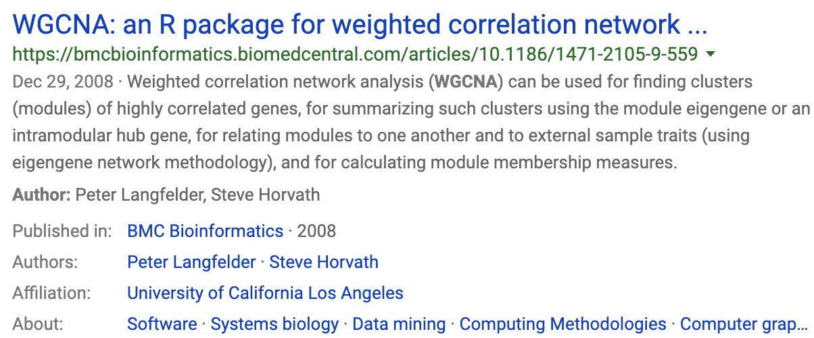
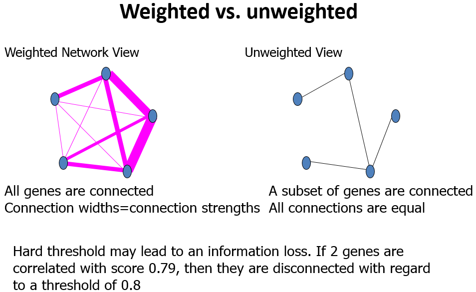
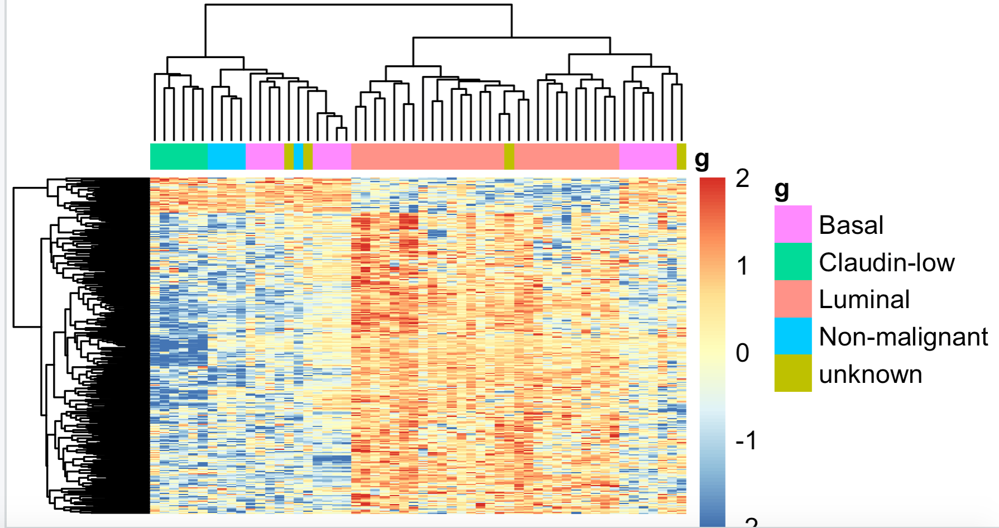

# WGCNA 分析

发现我这个**4年前的WGCNA分析教程**可以排在自己**最受欢迎的前10个教程**里面了，而且直接以我这个授课代码出的SCI文章就有38篇了，当然不排除很多学员使用我的代码却不告知我，也不会引用我。

不过，我这点战绩根本就算不上什么，其实这个WGCNA包已经是**十多年前发表的**了，仍然是广受好评及引用量一直在增加，**破万**也是指日可待。



大家首先可以看到3个教程：

- 2016-WGCNA-HCC-hub-gene.pdf 中文文章范例）
- WGCNA_GBMTutorialHorvath.pdf	
- WGCNA_YeastTutorialHorvath.pdf

其中第一个是我4年前的WGCNA分析教程最主要的参考文献，后面两个是英文教程，我相信你大概率是不会去看的，不过，我还是放在这里了。（还是需要强调，这两个英文教程完整的展现了WGCNA的全部用法）

然后你只需要简单浏览本文档，就可以在`rstudio`里面打开后缀是`proj`的文件，打开R代码，一步步跟着学习啦！

## 基本概念

WGCNA其译为**加权基因共表达网络分析**。该分析方法旨在寻找协同表达的基因模块(module)，并探索基因网络与关注的表型之间的关联关系，以及网络中的核心基因。

适用于复杂的数据模式，**推荐5组(或者15个样品)以上的数据**。一般可应用的研究方向有：不同器官或组织类型发育调控、同一组织不同发育调控、非生物胁迫不同时间点应答、病原菌侵染后不同时间点应答。

## 基本原理

从方法上来讲，WGCNA分为**表达量聚类分析和表型关联**两部分，主要包括基因之间相关系数计算、基因模块的确定、共表达网络、模块与性状关联四个步骤。

第一步计算任意两个基因之间的相关系数（Person Coefficient）。为了衡量两个基因是否具有相似表达模式，一般需要设置阈值来筛选，高于阈值的则认为是相似的。但是这样如果将阈值设为0.8，那么很难说明0.8和0.79两个是有显著差别的。因此，**WGCNA分析时采用相关系数加权值，即对基因相关系数取N次幂**，使得网络中的基因之间的连接服从**无尺度网络分布(scale-freenetworks)**，这种算法更具生物学意义。

第二步通过基因之间的相关系数构建分层聚类树，**聚类树的不同分支代表不同的基因模块**，不同颜色代表不同的模块。基于基因的加权相关系数，将基因按照表达模式进行分类，将模式相似的基因归为一个模块。这样就可以**将几万个基因通过基因表达模式被分成了几十个模块**，是一个提取归纳信息的过程。

## WGCNA术语

#### 权重(weghted)

基因之间不仅仅是相关与否，还记录着它们的相关性数值，数值就是基因之间的**联系的权重(相关性)。**



#### Module

模块(module)：表达模式相似的基因分为一类，这样的一类基因成为模块；

#### Eigengene

Eigengene（eigen  +‎ gene）：基因和样本构成的矩阵，[https://en.wiktionary.org/wiki/eigengene](https://en.wiktionary.org/wiki/eigengene)

#### Adjacency Matrix

**邻近矩阵：**是图的一种存储形式，用一个一维数组存放图中所有顶点数据；用一个二维数组存放顶点间关系（边或弧）的数据，这个**二维数组**称为邻接矩阵；在WGCNA分析里面指的是基因与基因之间的**相关性系数矩阵。** 如果用了阈值来判断基因相关与否，那么这个邻近矩阵就是0/1矩阵，只记录基因相关与否。但是WGCNA没有用阈值来卡基因的相关性，而是记录了所有基因之间的相关性。

#### Topological Overlap Matrix (TOM)

WGNA认为基因之间的简单的相关性不足以计算共表达，所以它利用上面的邻近矩阵，又计算了一个新的邻近矩阵。一般来说，TOM就是WGCNA分析的最终结果，后续的只是对TOM的下游注释。

## 下游分析

#### 得到模块之后的分析有：

**1.模块的功能富集**

**2.模块与性状之间的相关性**

**3.模块与样本间的相关系数**

#### 挖掘模块的关键信息：

**1.找到模块的核心基因**

**2.利用关系预测基因功能**

## 代码示例

其中第一步数据准备反而是最复杂的，取决于大家的R语言水平，这个数据``GSE48213-wgcna-input.RData``我已经保存下来咯，如果大家不会做，又想体验一下这个WGCNA流程，就可以直接**load**我保存好的数据文件即可。

### step1: 输入数据的准备

这里主要是**表达矩阵**， 如果是芯片数据，那么常规的归一化矩阵即可，如果是转录组数据，最好是RPKM/TPM值或者其它归一化好的表达量。然后就是**临床信息**或者其它表型，总之就是**样本的属性**。

为了保证后续脚本的统一性，表达矩阵统一用**datExpr**标识，临床 信息统一用**datTraits**标识。(PS: 如果你R语言很差，变量名不要轻易修改) 

```R
library(WGCNA)
RNAseq_voom <- fpkm 
## 因为WGCNA针对的是基因进行聚类，而一般我们的聚类是针对样本用hclust即可，所以这个时候需要转置。
WGCNA_matrix = t(RNAseq_voom[order(apply(RNAseq_voom,1,mad), decreasing = T)[1:5000],])
datExpr0 <- WGCNA_matrix  ## top 5000 mad genes
datExpr <- datExpr0 

## 下面主要是为了防止临床表型与样本名字对不上
sampleNames = rownames(datExpr);
traitRows = match(sampleNames, datTraits$gsm)  
rownames(datTraits) = datTraits[traitRows, 1] 
```

上面代码里面的rpkm就是我们的转录组数据的表达矩阵，以rpkm为单位。而datTraits就是所有样本对应的表型信息。需要自己制作，这个是学习WGCNA的基础，本次实例代码都是基于这两个数据。至于如何做出上面代码的两个例子，**取决于大家自己的项目，我这里给出自己的代码，仅供参考哈！**

```R
setwd('WGCNA/')
# 	56 breast cancer cell lines were profiled to identify patterns of gene expression associated with subtype and response to therapeutic compounds.
if(F){
  ## https://www.ncbi.nlm.nih.gov/geo/query/acc.cgi?acc=GSE48213
  #wget -c ftp://ftp.ncbi.nlm.nih.gov/geo/series/GSE48nnn/GSE48213/suppl/GSE48213_RAW.tar
  #tar -xf GSE48213_RAW.tar
  #gzip -d *.gz
  ## 首先在GSE48213_RAW目录里面生成tmp.txt文件，使用shell脚本
  # awk '{print FILENAME"\t"$0}' GSM*.txt |grep -v EnsEMBL_Gene_ID >tmp.txt
  #  其实也可以直接使用R来读取GSE48213_RAW.tar里面的gz文件，这里就不演示了
  # 可以参考：https://mp.weixin.qq.com/s/OLc9QmfN0YcT548VAYgOPA 里面的教程
  ## 然后把tmp.txt导入R语言里面用reshape2处理即可
  # 这个 tmp.txt 文件应该是100M左右大小哦。
  a=read.table('GSE48213_RAW/tmp.txt',sep = '\t',stringsAsFactors = F)
  library(reshape2)
  fpkm <- dcast(a,formula = V2~V1)
  rownames(fpkm)=fpkm[,1]
  fpkm=fpkm[,-1]
  colnames(fpkm)=sapply(colnames(fpkm),function(x) strsplit(x,"_")[[1]][1])
  
  library(GEOquery)
  a=getGEO('GSE48213')
  metadata=pData(a[[1]])[,c(2,10,12)]
  datTraits = data.frame(gsm=metadata[,1],
             cellline=trimws(sapply(as.character(metadata$characteristics_ch1),function(x) strsplit(x,":")[[1]][2])),
             subtype=trimws(sapply(as.character(metadata$characteristics_ch1.2),function(x) strsplit(x,":")[[1]][2]))
             )
save(fpkm,datTraits,file = 'GSE48213-wgcna-input.RData')
}
```

很明显，这个数据``GSE48213-wgcna-input.RData``我已经保存下来咯，如果大家不会做，又想体验一下这个WGCNA流程，那么可以找我email求取这个数据哦。我的邮箱是`` jmzeng1314@163.com ``

我给大家演示的示例数据大概是下面这个样子：

```
> head(datTraits)  ## 56 个细胞系的分类信息，表型
                  gsm cellline       subtype
GSM1172844 GSM1172844    184A1 Non-malignant
GSM1172845 GSM1172845    184B5 Non-malignant
GSM1172846 GSM1172846    21MT1         Basal
GSM1172847 GSM1172847    21MT2         Basal
GSM1172848 GSM1172848     21NT         Basal
GSM1172849 GSM1172849     21PT         Basal
> fpkm[1:4,1:4]  ## 56个细胞系的36953个基因的表达矩阵
                GSM1172844 GSM1172845 GSM1172846  GSM1172847
ENSG00000000003   95.21255   95.69868   19.99467  65.6863763
ENSG00000000005    0.00000    0.00000    0.00000   0.1492021
ENSG00000000419  453.20831  243.64804  142.05818 200.4131493
ENSG00000000457   18.10439   26.56661   16.12776  12.0873135
> 
```

这个数据集里面的**56种细胞系被分成了5组，如果要分开两两做差异分析，有10种组合，也就是说需要做10次差异分析**，每个差异分析结果都需要去注释，会比较麻烦，这个时候WGCNA就派上用场啦。当然，如果你一定要去做差异分析，我也给你代码：https://github.com/jmzeng1314/my-R/blob/master/10-RNA-seq-3-groups/hisat2_mm10_htseq.R

实际上多个分组，**差异分析策略是非常个性化**的， 比如：https://mp.weixin.qq.com/s/hc6JkKxyelc7b1M1MRiHRQ 

### step2:确定最佳beta值

选择合适“软阀值（soft thresholding power）”beta，同样的，也是使用教程标准代码即可：

```R
powers = c(c(1:10), seq(from = 12, to=20, by=2))
# Call the network topology analysis function
sft = pickSoftThreshold(datExpr, powerVector = powers, verbose = 5)
#设置网络构建参数选择范围，计算无尺度分布拓扑矩阵

  # Plot the results:
  ##sizeGrWindow(9, 5)
  par(mfrow = c(1,2));
  cex1 = 0.9;
  # Scale-free topology fit index as a function of the soft-thresholding power
  plot(sft$fitIndices[,1], -sign(sft$fitIndices[,3])*sft$fitIndices[,2],
       xlab="Soft Threshold (power)",ylab="Scale Free Topology Model Fit,signed R^2",type="n",
       main = paste("Scale independence"));
  text(sft$fitIndices[,1], -sign(sft$fitIndices[,3])*sft$fitIndices[,2],
       labels=powers,cex=cex1,col="red");
  # this line corresponds to using an R^2 cut-off of h
  abline(h=0.90,col="red")
  # Mean connectivity as a function of the soft-thresholding power
  plot(sft$fitIndices[,1], sft$fitIndices[,5],
       xlab="Soft Threshold (power)",ylab="Mean Connectivity", type="n",
       main = paste("Mean connectivity"))
  text(sft$fitIndices[,1], sft$fitIndices[,5], labels=powers, cex=cex1,col="red")
```

关键就是理解``pickSoftThreshold``函数及其返回的对象，最佳的beta值就是``sft$powerEstimate``

  

参数beta取值默认是1到30，上述图形的横轴均代表权重参数β，左图纵轴代表对应的网络中log(k)与log(p(k))相关系数的平方。**相关系数的平方越高，说明该网络越逼近无网路尺度的分布。**右图的纵轴代表对应的基因模块中所有基因邻接函数的均值。最佳的beta值就是``sft$powerEstimate``，已经被保存到变量了，不需要知道具体是什么，后面的代码都用这个即可，在本例子里面是6。

即使你不理解它，也可以使用代码拿到**合适“软阀值（soft thresholding power）”beta**进行后续分析。

### step3：一步法构建共表达矩阵

有了表达矩阵和估计好的最佳beta值，就可以直接构建共表达矩阵了。

```R
net = blockwiseModules(
				 datExpr,
				 power = sft$powerEstimate,
				 maxBlockSize = 6000,
				 TOMType = "unsigned", minModuleSize = 30,
				 reassignThreshold = 0, mergeCutHeight = 0.25,
				 numericLabels = TRUE, pamRespectsDendro = FALSE,
				 saveTOMs = F, 
				 verbose = 3
 )
 table(net$colors) 
```

所有的核心就在这一步，把输入的表达矩阵的**几千个基因组归类成了几十个模块。**大体思路：计算基因间的邻接性，根据邻接性计算基因间的相似性，然后推出基因间的相异性系数，并据此得到基因间的系统聚类树。然后按照混合动态剪切树的标准，设置每个基因模块最少的基因数目为30。

根据动态剪切法确定基因模块后，再次分析，依次计算每个模块的特征向量值，然后对模块进行聚类分析，将距离较近的模块合并为新的模块。

### step4: 模块可视化

这里用不同的颜色来代表那些所有的模块，其中灰色默认是无法归类于任何模块的那些基因，如果灰色模块里面的基因太多，那么前期对表达矩阵挑选基因的步骤可能就不太合适。

```R
# Convert labels to colors for plotting
mergedColors = labels2colors(net$colors)
table(mergedColors)
# Plot the dendrogram and the module colors underneath
plotDendroAndColors(net$dendrograms[[1]], mergedColors[net$blockGenes[[1]]],
                    "Module colors",
                    dendroLabels = FALSE, hang = 0.03,
                    addGuide = TRUE, guideHang = 0.05)
## assign all of the gene to their corresponding module 
## hclust for the genes.
```

  

这里的重点就是``plotDendroAndColors``函数，它接受一个聚类的对象，以及该对象里面包含的所有个体所对应的颜色。比如对表达矩阵进行hclust之后，加上表达矩阵里面所有样本的分组信息对应的颜色，也是可以用``plotDendroAndColors``函数可视化的，比如下面的样品图：

```R
#明确样本数和基因数
nGenes = ncol(datExpr)
nSamples = nrow(datExpr)
#首先针对样本做个系统聚类树
datExpr_tree<-hclust(dist(datExpr), method = "average")
par(mar = c(0,5,2,0))
plot(datExpr_tree, main = "Sample clustering", sub="", xlab="", cex.lab = 2, 
     cex.axis = 1, cex.main = 1,cex.lab=1)
## 如果这个时候样本是有性状，或者临床表型的，可以加进去看看是否聚类合理
#针对前面构造的样品矩阵添加对应颜色
sample_colors <- numbers2colors(as.numeric(factor(datTraits$Tumor.Type)), 
                                colors = c("white","blue","red","green"),signed = FALSE)
## 这个给样品添加对应颜色的代码需要自行修改以适应自己的数据分析项目。
#  sample_colors <- numbers2colors( datTraits ,signed = FALSE)
## 如果样品有多种分类情况，而且 datTraits 里面都是分类信息，那么可以直接用上面代码，当然，这样给的颜色不明显，意义不大。
#构造10个样品的系统聚类树及性状热图
par(mar = c(1,4,3,1),cex=0.8)
plotDendroAndColors(datExpr_tree, sample_colors,
                    groupLabels = colnames(sample),
                    cex.dendroLabels = 0.8,
                    marAll = c(1, 4, 3, 1),
                    cex.rowText = 0.01,
                    main = "Sample dendrogram and trait heatmap")
```

上面给样本进行聚类的代码可以不运行，其实跟WGCNA本身关系不大。

 

可以看到这些乳腺癌的细胞系的表达谱聚类情况并不是完全与其分类匹配，所以仅仅是根据样本的分组信息做差异分析并不完全准确。

### step5:模块和性状的关系

```R
## step 5 (最重要的) 模块和性状的关系
## 这一步主要是针对于连续变量，如果是分类变量，需要转换成连续变量方可使用
table(datTraits$subtype)
if(T){
  nGenes = ncol(datExpr)
  nSamples = nrow(datExpr)
  design=model.matrix(~0+ datTraits$subtype)
  colnames(design)=levels(datTraits$subtype)
  moduleColors <- labels2colors(net$colors)
  # Recalculate MEs with color labels
  MEs0 = moduleEigengenes(datExpr, moduleColors)$eigengenes
  MEs = orderMEs(MEs0); ##不同颜色的模块的ME值矩 (样本vs模块)
  moduleTraitCor = cor(MEs, design , use = "p");
  moduleTraitPvalue = corPvalueStudent(moduleTraitCor, nSamples)
  
  sizeGrWindow(10,6)
  # Will display correlations and their p-values
  textMatrix = paste(signif(moduleTraitCor, 2), "\n(",
                     signif(moduleTraitPvalue, 1), ")", sep = "");
  dim(textMatrix) = dim(moduleTraitCor)
  png("step5-Module-trait-relationships.png",width = 800,height = 1200,res = 120)
  par(mar = c(6, 8.5, 3, 3));
  # Display the correlation values within a heatmap plot
  labeledHeatmap(Matrix = moduleTraitCor,
                 xLabels = colnames(design),
                 yLabels = names(MEs),
                 ySymbols = names(MEs),
                 colorLabels = FALSE,
                 colors = greenWhiteRed(50),
                 textMatrix = textMatrix,
                 setStdMargins = FALSE,
                 cex.text = 0.5,
                 zlim = c(-1,1),
                 main = paste("Module-trait relationships"))
  dev.off()
  
  # 除了上面的热图展现形状与基因模块的相关性外
  # 还可以是条形图,但是只能是指定某个形状
  # 或者自己循环一下批量出图。
  Luminal = as.data.frame(design[,3]);
  names(Luminal) = "Luminal"
  y=Luminal
  GS1=as.numeric(cor(y,datExpr, use="p"))
  GeneSignificance=abs(GS1)
  # Next module significance is defined as average gene significance.
  ModuleSignificance=tapply(GeneSignificance,
                            moduleColors, mean, na.rm=T)
  sizeGrWindow(8,7)
  par(mfrow = c(1,1))
  # 如果模块太多，下面的展示就不友好
  # 不过，我们可以自定义出图。
  plotModuleSignificance(GeneSignificance,moduleColors)
  
}
```

通过模块与各种表型的相关系数，可以很清楚的挑选自己感兴趣的模块进行下游分析了。这个图就是把``moduleTraitCor``这个矩阵给用热图可视化一下。

 

因为一些历史遗留问题，这个图片缺乏X轴的标记。

从上图已经可以看到跟乳腺癌分类相关的基因模块了，包括``"Basal"         "Claudin-low"   "Luminal"       "Non-malignant" "unknown" `` 这5类所对应的不同模块的基因列表。可以看到每一种乳腺癌都有跟它强烈相关的模块，可以作为它的表达signature，模块里面的基因可以拿去做下游分析。我们看到**Luminal表型**跟**棕色的模块**相关性高达0.86，而且极其显著的相关，所以值得我们挖掘，这**个模块里面的基因是什么，为什么如此的相关呢？**

### step6:感兴趣性状的模块的具体基因分析

性状跟模块虽然求出了相关性，可以挑选最相关的那些模块来分析，但是模块本身仍然包含非常多的基因，还需进一步的寻找最重要的基因。所有的模块都可以跟基因算出相关系数，所有的连续型性状也可以跟基因的表达值算出相关系数。主要参考资料：[PDF document](https://labs.genetics.ucla.edu/horvath/CoexpressionNetwork/Rpackages/WGCNA/Tutorials/FemaleLiver-03-relateModsToExt.pdf), [R script](https://labs.genetics.ucla.edu/horvath/CoexpressionNetwork/Rpackages/WGCNA/Tutorials/FemaleLiver-03-relateModsToExt.R)  如果跟性状显著相关基因也跟某个模块显著相关，那么这些基因可能就非常重要。

#### 首先计算模块与基因的相关性矩阵

```R
# names (colors) of the modules
modNames = substring(names(MEs), 3)
geneModuleMembership = as.data.frame(cor(datExpr, MEs, use = "p"));
## 算出每个模块跟基因的皮尔森相关系数矩阵
## MEs是每个模块在每个样本里面的值
## datExpr是每个基因在每个样本的表达量
MMPvalue = as.data.frame(corPvalueStudent(as.matrix(geneModuleMembership), nSamples));
names(geneModuleMembership) = paste("MM", modNames, sep="");
names(MMPvalue) = paste("p.MM", modNames, sep="");

```

#### 再计算性状与基因的相关性矩阵

```R
  
  ## 只有连续型性状才能只有计算
  ## 这里把是否属于 Luminal 表型这个变量用0,1进行数值化。
  Luminal = as.data.frame(design[,3]);
  names(Luminal) = "Luminal"
  geneTraitSignificance = as.data.frame(cor(datExpr, Luminal, use = "p"));
  GSPvalue = as.data.frame(corPvalueStudent(as.matrix(geneTraitSignificance), nSamples));
  names(geneTraitSignificance) = paste("GS.", names(Luminal), sep="");
  names(GSPvalue) = paste("p.GS.", names(Luminal), sep="");
  
```

#### 最后把两个相关性矩阵联合起来,指定感兴趣模块进行分析

```R
 module = "brown"
  column = match(module, modNames);
  moduleGenes = moduleColors==module;
  sizeGrWindow(7, 7);
  par(mfrow = c(1,1));
  verboseScatterplot(abs(geneModuleMembership[moduleGenes, column]),
                     abs(geneTraitSignificance[moduleGenes, 1]),
                     xlab = paste("Module Membership in", module, "module"),
                     ylab = "Gene significance for Luminal",
                     main = paste("Module membership vs. gene significance\n"),
                     cex.main = 1.2, cex.lab = 1.2, cex.axis = 1.2, col = module)
```

 

可以看到这些基因不仅仅是跟其对应的模块高度相关，而且是跟其对应的性状高度相关，进一步说明了基因值得深度探究。 

### step7:网络的可视化

主要参考资料：[PDF document](https://labs.genetics.ucla.edu/horvath/CoexpressionNetwork/Rpackages/WGCNA/Tutorials/FemaleLiver-05-Visualization.pdf), [R script](https://labs.genetics.ucla.edu/horvath/CoexpressionNetwork/Rpackages/WGCNA/Tutorials/FemaleLiver-05-Visualization.R)

#### 首先针对所有基因画热图

```R
# 主要是可视化 TOM矩阵，WGCNA的标准配图
# 然后可视化不同 模块 的相关性 热图
# 不同模块的层次聚类图
# 还有模块诊断，主要是 intramodular connectivity
if(T){
  nGenes = ncol(datExpr)
  nSamples = nrow(datExpr)
  geneTree = net$dendrograms[[1]]; 
  dissTOM = 1-TOMsimilarityFromExpr(datExpr, power = 6); 
  plotTOM = dissTOM^7; 
  diag(plotTOM) = NA; 
  #TOMplot(plotTOM, geneTree, moduleColors, main = "Network heatmap plot, all genes")
  nSelect = 400
  # For reproducibility, we set the random seed
  set.seed(10);
  select = sample(nGenes, size = nSelect);
  selectTOM = dissTOM[select, select];
  # There’s no simple way of restricting a clustering tree to a subset of genes, so we must re-cluster.
  selectTree = hclust(as.dist(selectTOM), method = "average")
  selectColors = moduleColors[select];
  # Open a graphical window
  sizeGrWindow(9,9)
  # Taking the dissimilarity to a power, say 10, makes the plot more informative by effectively changing
  # the color palette; setting the diagonal to NA also improves the clarity of the plot
  plotDiss = selectTOM^7;
  diag(plotDiss) = NA;
  
  png("step7-Network-heatmap.png",width = 800,height = 600)
  TOMplot(plotDiss, selectTree, selectColors, main = "Network heatmap plot, selected genes")
  dev.off()
  
  # Recalculate module eigengenes
  MEs = moduleEigengenes(datExpr, moduleColors)$eigengenes
  ## 只有连续型性状才能只有计算
  ## 这里把是否属 Luminal 表型这个变量0,1进行数值化
  Luminal = as.data.frame(design[,3]);
  names(Luminal) = "Luminal"
  # Add the weight to existing module eigengenes
  MET = orderMEs(cbind(MEs, Luminal))
  # Plot the relationships among the eigengenes and the trait
  sizeGrWindow(5,7.5);
  
  par(cex = 0.9)
  png("step7-Eigengene-dendrogram.png",width = 800,height = 600)
  plotEigengeneNetworks(MET, "", marDendro = c(0,4,1,2), marHeatmap = c(3,4,1,2), cex.lab = 0.8, xLabelsAngle
                        = 90)
  dev.off()
  
  # Plot the dendrogram
  sizeGrWindow(6,6);
  par(cex = 1.0)
  ## 模块的进化树
  png("step7-Eigengene-dendrogram-hclust.png",width = 800,height = 600)
  plotEigengeneNetworks(MET, "Eigengene dendrogram", marDendro = c(0,4,2,0),
                        plotHeatmaps = FALSE)
  dev.off()
  # Plot the heatmap matrix (note: this plot will overwrite the dendrogram plot)
  par(cex = 1.0)
  ## 性状与模块热
  
  png("step7-Eigengene-adjacency-heatmap.png",width = 800,height = 600)
  plotEigengeneNetworks(MET, "Eigengene adjacency heatmap", marHeatmap = c(3,4,2,2),
                        plotDendrograms = FALSE, xLabelsAngle = 90)
  dev.off()
  
}

```

这个非常消耗计算资源和时间，所以建议选取其中部分基因作图即可，我就没有画，而且根据下面的代码选取部分基因来作图！

#### 然后随机选取部分基因作图

```R
nSelect = 400
# For reproducibility, we set the random seed
set.seed(10);
select = sample(nGenes, size = nSelect);
selectTOM = dissTOM[select, select];
# There’s no simple way of restricting a clustering tree to a subset of genes, so we must re-cluster.
selectTree = hclust(as.dist(selectTOM), method = "average")
selectColors = moduleColors[select];
# Open a graphical window
sizeGrWindow(9,9)
# Taking the dissimilarity to a power, say 10, makes the plot more informative by effectively changing
# the color palette; setting the diagonal to NA also improves the clarity of the plot
plotDiss = selectTOM^7;
diag(plotDiss) = NA;
TOMplot(plotDiss, selectTree, selectColors, main = "Network heatmap plot, selected genes")
```

  

这个图凑数的意义居多，如果是把全部基因画上去，可以很清楚的看到各个区块颜色差异。

#### 最后画模块和性状的关系

```R
 # Recalculate module eigengenes
  MEs = moduleEigengenes(datExpr, moduleColors)$eigengenes
  ## 只有连续型性状才能只有计算
  ## 这里把是否属于 Luminal 表型这个变量用0,1进行数值化。
  Luminal = as.data.frame(design[,3]);
  names(Luminal) = "Luminal"
  # Add the weight to existing module eigengenes
  MET = orderMEs(cbind(MEs, Luminal))
  # Plot the relationships among the eigengenes and the trait
  sizeGrWindow(5,7.5);
  par(cex = 0.9)
  plotEigengeneNetworks(MET, "", marDendro = c(0,4,1,2), marHeatmap = c(3,4,1,2), cex.lab = 0.8, xLabelsAngle
                        = 90)
  # Plot the dendrogram
  sizeGrWindow(6,6);
  par(cex = 1.0)
  ## 模块的聚类图
  plotEigengeneNetworks(MET, "Eigengene dendrogram", marDendro = c(0,4,2,0),
                        plotHeatmaps = FALSE)
  # Plot the heatmap matrix (note: this plot will overwrite the dendrogram plot)
  par(cex = 1.0)
  ## 性状与模块热图
  plotEigengeneNetworks(MET, "Eigengene adjacency heatmap", marHeatmap = c(3,4,2,2),
                        plotDendrograms = FALSE, xLabelsAngle = 90)
  
  
```

  

## step8:提取指定模块的基因名

```R
## step 8 
# 主要是关心具体某个模块内部的基因
if(T){
  # Select module
  module = "brown";
  # Select module probes
  probes = colnames(datExpr) ## 我们例子里面的probe就是基因
  inModule = (moduleColors==module);
  modProbes = probes[inModule]; 
  head(modProbes)
  
  # 如果使用WGCNA包自带的热图就很丑。
  which.module="brown";
  dat=datExpr[,moduleColors==which.module ] 
  plotMat(t(scale(dat)),nrgcols=30,rlabels=T,
          clabels=T,rcols=which.module,
          title=which.module )
  datExpr[1:4,1:4]
  dat=t(datExpr[,moduleColors==which.module ] )
  library(pheatmap)
  pheatmap(dat ,show_colnames =F,show_rownames = F) #对那些提取出来的1000个基因所在的每一行取出，组合起来为一个新的表达矩阵
  n=t(scale(t(log(dat+1)))) # 'scale'可以对log-ratio数值进行归一化
  n[n>2]=2 
  n[n< -2]= -2
  n[1:4,1:4]
  pheatmap(n,show_colnames =F,show_rownames = F)
  group_list=datTraits$subtype
  ac=data.frame(g=group_list)
  rownames(ac)=colnames(n) 
  pheatmap(n,show_colnames =F,show_rownames = F,
           annotation_col=ac )
  # 可以很清晰的看到，所有的形状相关的模块基因
  # 其实未必就不是差异表达基因。
}

```

有了基因信息，下游分析就很简单了。包括GO/KEGG等功能数据库的注释



## Step9: 模块的导出

主要模块里面的基因直接的相互作用关系信息可以导出到**cytoscape**,**VisANT**等网络可视化软件。

```R
# Recalculate topological overlap
TOM = TOMsimilarityFromExpr(datExpr, power = 6); 
# Select module
module = "brown";
# Select module probes
probes = colnames(datExpr) ## 我们例子里面的probe就是基因名
inModule = (moduleColors==module);
modProbes = probes[inModule]; 
## 也是提取指定模块的基因名
# Select the corresponding Topological Overlap
modTOM = TOM[inModule, inModule];
dimnames(modTOM) = list(modProbes, modProbes)
## 模块对应的基因关系矩阵 
```

首先是导出到**VisANT**

```R
vis = exportNetworkToVisANT(modTOM,
file = paste("VisANTInput-", module, ".txt", sep=""),
weighted = TRUE,
threshold = 0)
```

然后是导出到**cytoscape**

```r
  cyt = exportNetworkToCytoscape(
       modTOM,
      edgeFile = paste("CytoscapeInput-edges-", paste(module, collapse="-"), ".txt", sep=""),
      nodeFile = paste("CytoscapeInput-nodes-", paste(module, collapse="-"), ".txt", sep=""),
      weighted = TRUE,
      threshold = 0.02,
      nodeNames = modProbes, 
      nodeAttr = moduleColors[inModule]
                                );
```

如果模块包含的基因太多，网络太复杂，还可以进行筛选，比如：

```
nTop = 30;
IMConn = softConnectivity(datExpr[, modProbes]);
top = (rank(-IMConn) <= nTop)
filter <- modTOM[top, top]
```

后面就是cytoscape自身的教程了，这里不再赘述，我博客有比较详尽的介绍。