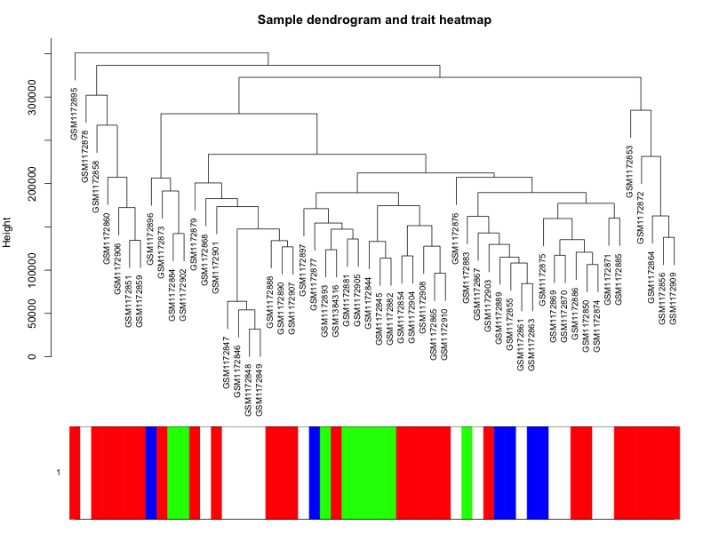

# 通过WGCNA作者的测试数据来学习

测试数据下载链接在：https://horvath.genetics.ucla.edu/html/CoexpressionNetwork/Rpackages/WGCNA/Tutorials/SimulatedData.zip 

在这样的测试数据里面很容易跟着作者的文档，一步步掌握WGCNA，文档步骤目录如下：

- Simulation of expression and trait data: [PDF document](https://horvath.genetics.ucla.edu/html/CoexpressionNetwork/Rpackages/WGCNA/Tutorials/Simulated-01-dataSimulation.pdf), [R script](https://horvath.genetics.ucla.edu/html/CoexpressionNetwork/Rpackages/WGCNA/Tutorials/Simulated-01-dataSimulation.R)
- Loading of expression data, an alternative to data simulation, provided to illustrate data loading of real data: [PDF document](https://horvath.genetics.ucla.edu/html/CoexpressionNetwork/Rpackages/WGCNA/Tutorials/Simulated-02-dataLoading.pdf), [R script](https://horvath.genetics.ucla.edu/html/CoexpressionNetwork/Rpackages/WGCNA/Tutorials/Simulated-02-dataLoading.R)
- Basic data preprocessing illustrates rudimentary techniques for handling missing data and removing outliers: [PDF document](https://horvath.genetics.ucla.edu/html/CoexpressionNetwork/Rpackages/WGCNA/Tutorials/Simulated-03-Preprocessing.pdf), [R script](https://horvath.genetics.ucla.edu/html/CoexpressionNetwork/Rpackages/WGCNA/Tutorials/Simulated-03-Preprocessing.R)
- Standard gene screening illustrates gene selection based on Pearson correlation and shows that the results are not satisfactory: [PDF document](https://horvath.genetics.ucla.edu/html/CoexpressionNetwork/Rpackages/WGCNA/Tutorials/Simulated-04-StandardScreening.pdf), [R script](https://horvath.genetics.ucla.edu/html/CoexpressionNetwork/Rpackages/WGCNA/Tutorials/Simulated-04-StandardScreening.R)
- Construction of a weighted gene co-expression network and network modules illustrated step-by-step; includes a discussion of alternate clustering techniques: [PDF document](https://horvath.genetics.ucla.edu/html/CoexpressionNetwork/Rpackages/WGCNA/Tutorials/Simulated-05-NetworkConstruction.pdf), [R script](https://horvath.genetics.ucla.edu/html/CoexpressionNetwork/Rpackages/WGCNA/Tutorials/Simulated-05-NetworkConstruction.R)
- Relating modules and module eigengenes to external data illustrates methods for relating modules to external microarray sample traits: [PDF document](https://horvath.genetics.ucla.edu/html/CoexpressionNetwork/Rpackages/WGCNA/Tutorials/Simulated-06-RelatingToExt.pdf), [R script](https://horvath.genetics.ucla.edu/html/CoexpressionNetwork/Rpackages/WGCNA/Tutorials/Simulated-06-RelatingToExt.R)
- Module membership, intramodular connectivity, and screening for intramodular hub genes illustrates using the intramodular connectivity to define measures of module membership and to screen for genes based on network information: [PDF document](https://horvath.genetics.ucla.edu/html/CoexpressionNetwork/Rpackages/WGCNA/Tutorials/Simulated-07-Membership.pdf), [R script](https://horvath.genetics.ucla.edu/html/CoexpressionNetwork/Rpackages/WGCNA/Tutorials/Simulated-07-Membership.R)
- Visualization of gene networks: [PDF document](https://horvath.genetics.ucla.edu/html/CoexpressionNetwork/Rpackages/WGCNA/Tutorials/Simulated-08-Visualization.pdf), [R script](https://horvath.genetics.ucla.edu/html/CoexpressionNetwork/Rpackages/WGCNA/Tutorials/Simulated-08-Visualization.R)

### 第一步：了解测试数据

这里作者模拟了 3000 genes in 50 samples 的表达矩阵，然后这3000个基因可以使用WGCNA算法比较好的区分成为5个模块，颜色可以标记为(  turquoise, blue, brown, green, and yellow)，当然，还有大量的基因处于grey模块，就是需要忽略掉的。

另外值得注意的是，作者模拟了 **a simulated clinical trait y **  这个表型信息，在后续分析也用得上。

这个模拟数据的代码，非常值得学习，因为它蕴藏着WGCNA的原理，相当于反向解析。

### 第二步：在R里面载入测试数据

这个只需要注意一下R语言项目管理模式即可，使用Rstudio新建project文件夹。

### 第三步： 数据预处理

主要是去除离群点，包括样本和基因，主要是R基础代码的应用。

也可以简单的层次聚类，看看数据分布，样本距离。在我<https://github.com/jmzeng1314/my_WGCNA> 展示的乳腺癌数据集，效果如下：



### 第四步：基因挑选

这个步骤主要是考虑到基因数量太大，后续计算量比较可观，很多基因是没有必要进入后续WGCNA环节的，这个时候很多人会喜欢先做差异分析，**挑选统计学显著的差异基因**，但是作者不认为这样的策略可取。

### 第五步：基因模块构建（主要）

首先需要使用函数 **pickSoftThreshold** 挑选最佳阈值！

然后使用函数 **blockwiseModules** 一步构建加权共表达网络（Weight co-expression network)

还可以使用函数 **plotDendroAndColors** 可视化我们的**基因模块树。**

### 第六步：模块内部诊断

根据模块的基因集表达矩阵，判断某个模块的eigengenes，然后基于各个模块的eigengenes进行**模块之间**相关性的计算

```r
datME=moduleEigengenes(datExpr,moduleColors)$eigengenes
signif(cor(datME, use="p"), 2)
dissimME=(1-t(cor(datME, method="p")))/2
hclustdatME=hclust(as.dist(dissimME), method="average" )
# Plot the eigengene dendrogram
par(mfrow=c(1,1))
plot(hclustdatME, main="Clustering tree based of the module eigengenes")
sizeGrWindow(8,9)
plotMEpairs(datME )
```

也可以查看具体**某个模块的基因集的表达量热图**

```r
sizeGrWindow(8,9)
par(mfrow=c(3,1), mar=c(1, 2, 4, 1))
which.module="turquoise";
plotMat(t(scale(datExpr[,colorh1==which.module ]) ),nrgcols=30,rlabels=T,
        clabels=T,rcols=which.module,
        title=which.module )

```

**如果有临床性状指标，**就可以把各个模块和临床指标进行相关性诊断。比如在我GitHub讲解的乳腺癌数据集是<https://github.com/jmzeng1314/my_WGCNA> 可以很清晰的看到不同乳腺癌压型有着不同相关性的基因模块。


### 第七步：挑选模块里面的重要基因

比如在我GitHub讲解的乳腺癌数据集是<https://github.com/jmzeng1314/my_WGCNA> 就挑选了Luminal这个亚型的形状，以及它最显著相关的 brown 模块进行后续分析。


### 第八步：模块的其它可视化

主要是TOM矩阵，凑数用，还有模块直接的相关性展示，基本上也是凑数的，如下：


### 写在最后

WGCNA包的作者，精心设计的这个测试数据集，其实最重要的不是WGCNA流程，而是它背后所呈现的原理。

希望你能静下心来读一遍。

